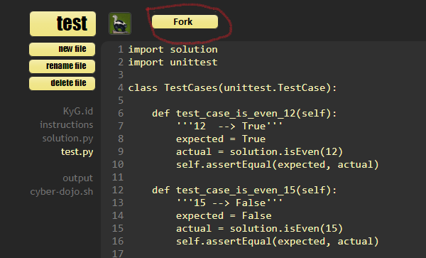
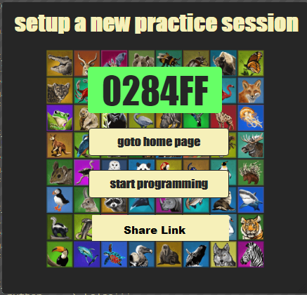
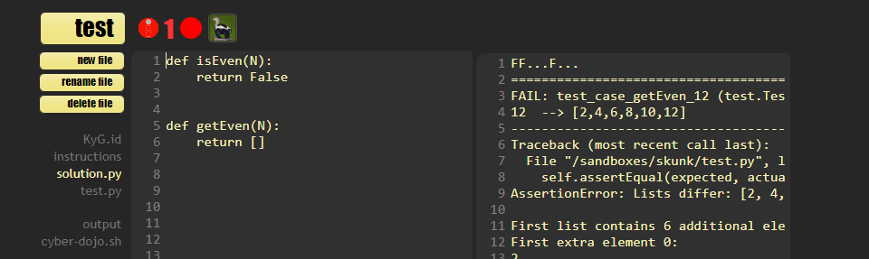

# CyberDojo - Desired Features List
### General
- Support for .md file to add images and formulae in the instruction file.
- Fork option in the front page itself (create as exercise), instead in review page.

- Enter the session as the 'TestUser' (to verify the exercise, before sharing)
- Option to edit and save the existing session, after publishing 
(Now, I need to create the new session and notify the users)
- Option to disable students from viewing others code for a specific period 
(say, for a week till the lab session is over)
- Auto save option (Now, we need to run once to save content)
- Share link/ copy link option when forked (Now we need to copy sesion ID and create the exercise link manually)

- Split window to display the compilation output and code/test cases side by side.

- When resuming/starting a session, it opens in a new tab. (showing home page in another tab)
Instead, the session shall be opened in the same window.

### User login and monitoring
- Share exercise via email option (and to track how many responded similar to Google forms)
- User needs to login (student name, rollno and email id) before entering the session,
 so that it will be easier to track students based on their names/ roll no/ email ID, instead of avatars

### Create course and modules
- Option to create course and modules (quiz)
- Categorization of exercises (to assign them to course and modules)
- Dashboard to view the students progress in the course or modules
- Integration with moodle (?)

### Badge
- Creation of a badge to be awarded for a problem

### Collaborative development
- The session mentor shall be able to send individual messages to the students.
- The session mentor shall be able to interactively edit the files of the students 

