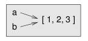
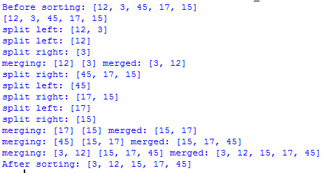

# UNIT IV: COMPOUND DATA
## LISTS, TUPLES, DICTIONARIES

Lists, list operations, list slices, list methods, list loop, mutability, aliasing, cloning lists, list parameters; Tuples, tuple assignment, tuple as return value; Dictionaries: operations and methods; advanced list processing - list comprehension, Illustrative programs: selection sort, insertion sort, merge sort, quick sort.

### Objective:
To use Python data structures –- lists, tuples, dictionaries

### Outcome:
Represent compound data using Python  lists, tuples, dictionaries

# 4 COMPOUND DATA

Primitive data types are basic data types such as int, bool and float. Compound data is any data type which is constructed using primitive data types and other compound data types. Python offers different compound data types (sequences) such as lists, tuples and dictionaries.

# 4.1 LISTS

List is the collection (bag) of objects. We extensively use list to store and manipulate data in everyday computing.

### Examples
1.	List of web pages matching the keyword (google)
2.	List of friends (facebook)
3.	List of products prices (amazon)
4.	List of tasks to do
5.	List of grocery items to be purchased
6.	List of students enrolled in a class

The objects in the list can be of same type or of different types.

### Example

```python
>>>grocery = ['bread', 'butter', 'milk']
>>>absentees = [3, 14, 24, 35, 37, 41]
>>>movie_review = ['enthiran', {'5-rating':344, '4-rating': 28, '3-rating':0}]
>>>my_friends = ['akil', 'kapil', 'dhoni']
>>>my_favorite_menu = ['idli','dhosa','pongal']
```
Lists may be constructed in several ways:
- Using a pair of square brackets to denote the empty list: []
- Using square brackets, separating items with commas: [a], [a, b, c]
- Using a list comprehension: [x for x in iterable]
- Using the type constructor: list() or list(iterable)

## 4.1.1 LIST OPERATIONS
### repeat (*)
```python
>>> mylist = [1, True, 'python']
>>> mylist * 2
[1, True, 'python',1, True, 'python']
```

### concatenate (+)
```python
>>>part1 = ['python','is']
>>>part2 = ['all', 'purpose', 'language']
>>>part1 + part2
['python','is','all', 'purpose', 'language']
```
### empty list
```python
>>>a = []
>>>not a
True
```

### index
```python
>>>mylist = [12, 48, 12, 72, 34, 21]
>>>mylist[1]
48
>>>mylist[0]
12
```

### Exercises
1.	What is the output?
```python
>>> a = 10
>>> mylist = [a]*5
>>> mylist[3]
```
2.	What is the output?
```python
>>> mylist1 = ['In', 'python']
>>> mylist2 = ['explicit','is','better']
>>> mylist = mylist1 + mylist2
>>> mylist += ['than','implicit']
>>> mylist
```

## 4.1.2 LIST SLICES

We can select the specific subset from the list using slicing. We can either use a positive index (forward) or negative index(reverse) to refer the particular element or slice in the list.

| Forward index | 	0	| 1	| 2 | 3 | 4 | 5 | 
|:------|:-------|:-------|:-------|:-------|:-------|:-------|
| mylist |	12 |	48	| 12 |	72 | 34 |	21 |
| Reverse index |	-6|	-5 |	-4 |	-3 |	-2 |	-1 |

### Example
```python
>>> mylist = [12, 48, 12, 72, 34, 21]
>>> mylist
[12, 48, 12, 72, 34, 21]
>>> mylist[2]
12
>>> mylist[-2]
34
>>> mylist[3]
72
```

List may be sliced into part, from  `start` till `end`.

 > ```mylist[start:end:step]```

The elements are picked in steps from `start`. If step is not mentioned, it is taken as 1 as default. The element at `end` is not included. 

### Example
```python
>>>mylist = [12, 48, 12, 72, 34, 21]
>>> mylist[1:3]
[48, 12]
>>> mylist[2:-2]
[12, 72]
>>> mylist[0:3]
[12, 48, 12]
>>> mylist[:3]
[12, 48, 12]
>>> mylist[3:]
[72, 34, 21]
# Elements at odd indices
>>> mylist[::2]
[12, 12, 34]
# In reverse order
>>> mylist[::-1]
[21, 34, 72, 12, 48, 12]
>>> mylist[::-2]
[21, 72, 48]
```

## 4.1.3 LIST METHODS
### count(x)
return the number of times x appears in the list.
```python
>>> mylist = [12, 12, 34, 34, 34]
>>> mylist.count(34)
3
```

### index(x)
return: the index of first occurence of x
```python
>>> mylist.index(34)
2
```

### insert(index,x)
insert an item at a given position(index).
```
>>> mylist.index(3,34)
# insert 34 at 3
```
list.append(x)
Add an item to the end of the list; equivalent to a[len(a):] = [x].

list.extend(L)
Extend the list by appending all the items in the given list; equivalent to a[len(a):] = L.

list.remove(x)
Remove the first item from the list whose value is x. 

list.pop([i])
Remove the item at the given position in the list, and return it. 

list.sort()
Sort the items of the list in place

list.reverse()
Reverse the elements of the list, in place.

Associated methods and attributes of a list may be viewed with `dir(mylist)`.

Exercises:
```python
1.	What is the error?
>>> mylist =  [12, 48, 34, 72, 56]
>>> mylist.pop(2)
>>> mylist.append(mylist.index(34))
2.	What is the output?
>>> mylist =  [12, 48, 34, 72, 56]
>>> mylist.remove(34)
>>> mylist.insert(2,2)
>>> mylist.sort()
>>> mylist.reverse()
>>> mylist.append(mylist.count(2))
>>> mylist
```

### 4.1.4 LIST LOOP

List is the collection of iterable items.  Using for loop, you can process each element in the list.

### Example
Find the maximum number in the list

```python
def get_maxnumber(numbers):
 maxval = None
 for element in numbers:
   if not maxval or element > maxval:
     maxval = element
 return maxval
 
# test
mylist = [1, 5, 67, 34, 128]
print(get_maxnumber(mylist))
```

### Exercise
1.	Find the sum of N numbers (using List)
2.	Create list with the following pattern for the input num:
```
Example: 
num = 4   	mylist  = [4, 8, 12, 16, 12, 8, 4]
num = 3    	mylist = [ 3, 6, 9, 6, 3]
```
3.	Create list with the following pattern for the input num:
```
Example
num = 4 	mylist = [1, 2, 3, 5, 6, 7, 9, 10, 11, 13, 14, 15]
num = 3	 mylist = [1, 2, 4, 5, 7, 8]
```
4.	Write a function to find the factorial of ‘n’?
5.	Find the sum of ‘n’ terms of the series
> `f = 0! + 1! + 2! + … +  n!  		(n >= 0)`
6.	Find whether `n` is the factorial number

## 4.1.6 Aliasing

If an object is referred by more than one variable name, it is aliased.
```python
>>> a = [1, 2, 3]
>>> b = a
>>> id(a), id(b)
(140143212216136, 140143212216136)
```


As list is mutable, a change by one reference is reflected in other reference, as both refer to the same list object.
```python
>>> b[1] = 100
>>> a
[1, 100, 3]
```
### Exercise
    What is the output?
```python
>>> a = [12,'python',True]
>>> b = a
>>> b[2] = False
>>> id(a) == id(b)
```

## 4.5 Illustrative Programs
## 4.5.1 Selection sort

### Exercises
1. Assume that first number in the list is minimum. Exchange, if first> second
Example
```
input = [12,3,15,7,23]	output = [3,12,15,7,23]
```
2. Assume that first element in the list is minimum. Compare it with every other element. Exchange if it is greater. (index selected = 0) 
```
### Example
[12,23,15,7,3]   As 12<23, don’t exchange.
[12,23,15,7,3] As 12<15, don’t exchange.
[12,23,15,7,3] As 12>7, exchange
[7,23,15,12,3] As 7>3, exchange
[3,23,15,12,7] Stop. 
```
3. Now, the first element is the minimum. Now, bring the next minimum value in the list as the second element. (index selected = 1)
```
### Example
[3,23,15,12,7] As 23>15, exchange
[3,15,23,12,7] As 15>12, exchange
[3,12,23,15,7] As 12>7, exchange
[3,7,23,15,12] stop
```
If we continue to place the subsequent minimum values, we get the sorted list.

|selected index (outer loop)| numbers|
|:--------------------------|--------|
Before sorting| 12 3 45 17 15| 
0| 3 12 45 17 15
1| 3 12 45 17 15
2| 3 12 15 45 17
3| 3 12 15 17 45

Selected index: 2 sorted in steps

|After inner iteration (j)| numbers|
|:------------------------|--------|
before sorting| 3 12 45 17 15
3| 3 12 17 45 15 
4| 3 12 15 45 17

### Algorithm
1. Select an index (i) successively from 0 to len(numbers)-2
2. Compare numbers[i] with each element in the remaining list
3. Swap numbers[i] with the element whenever numbers[i] is larger


### Pseudocode
```
selection_sort(numbers):
	N=len(numbers)
 for index in range(N-1): 
	 for j in range(index+1,N):
   If numbers[index] > numbers[j]:
	    swap (numbers[index], numbers[j])
```
Implementation

```python
def selection_sort(numbers):    
    N = len(numbers)    
    for index in range(N-1):        
        for j in range(index+1,N):
            if numbers[index] > numbers[j]:
                numbers[index], numbers[j] = numbers[j], numbers[index]
        print("Selected index:",index, numbers)

#Test
mylist=[12,3,45,17,15]
print("Before sorting:",mylist)
selection_sort(mylist)
print("After sorting:",mylist)
```


Output
```
Before sorting: [12, 3, 45, 17, 15]
Selected index: 0 [3, 12, 45, 17, 15]
Selected index: 1 [3, 12, 45, 17, 15]
Selected index: 2 [3, 12, 15, 45, 17]
Selected index: 3 [3, 12, 15, 17, 45]
After sorting: [3, 12, 15, 17, 45]
```


4.5.2 Insertion sort

Exercises:
1. Consider the second element in the list num. Insert at index 0, if element < first. hint: use insert()
2. Remove element if it is inserted. hint: use pop() or remove
3. Now num[0:1] is in sorted order. Now, consider the third element in the list (num[2]). Compare with first two elements. Insert at 0, if element is less than first. Insert at 1, if element is less than second. Remove num[2], if it is inserted.

Subsequently, the list num gets sorted.

|i|position to be inserted|num|
|:--|--|--|
1 |0|12	3 45 17 15 
2 | 2|3 12 45 17 15
3 | 2| 3 12 45 17 15
4| 2 | 3 12 17 45 15
sorted| 3 12 15 17 45

### Pseudocode
```
insertion_sort(num):
	for i in range(1,len(num)):
		element = num[i]
		inserted = False
		for j in range(i):
			if element < num[j]
insert element at j 
and break loop
		if inserted:
			remove element from i
```		
### Implementation
```python
def insertion_sort(num):    
    for i in range(1,len(num)):
        element = num[i]
        for j in range(i):
            if element < num[j]:
                print(num,"insert",element,"at",j)
                num.insert(j,element)
                num.pop(i+1)
	        break

#Test
mylist = [12,3,45,72,15]
insertion_sort(mylist)
print(mylist)
```
Output


### Pseudocode (v2)
```
insertion_sort(num):
	for i in range(1,len(num)):
		element=num[i]
		j=i
		while j > 0 and num[j-1] >  element:
			num[j]= num[j-1]
		num[j]= element
```
Implementation (v2)
```python
def insertion_sort(num):    
    for i in range(1,len(num)):
        element = num[i]        
        for j in range(i):
            if element < num[j]:
                print(num,"insert",element,"at",j)
                num.insert(j,element)
                num.pop(i+1)  
                break                       

# Test
mylist = [12,3,45,17,15]
insertion_sort(mylist)
print(mylist)

```

Output
```
[12, 3, 45, 17, 15] insert 3 at 0
[3, 12, 45, 17, 15] insert 17 at 2
[3, 12, 17, 45, 15] insert 15 at 2
[3, 12, 15, 17, 45]
```

## 4.5.3 Merge sort

It is divide recursively and conquer approach. 

### Exercise
1. Consider left and right lists of size 1. Merge them in a sorted order.
Example:
```
left = [12]  right = [3]
merged = [3,12]
```
2. Now consider the two sorted lists of unspecified size. Merge them in a sorted order.
Example:
```
left = [12,45]  right = [3,17]
merged = [3,12,17,45]
```
3. Divide the list num into left and right halves.
4. Recursively divide, till the partition size is 1
Example:
```
num = [12,3,45,17,15]
left = [12,3]
        left = [12]
        right = [3]
right = [45, 17, 15]
        left = [45]
        right = [17,15]
		left = [17]
		right = [15]
```

### Algorithm

1. Divide the list recursively to left and right halves, till the partition size is 1 
2. Merge the left and right halves in the sorted order

### Algorithm for merge
1. Remove the minimum of two lists left 
and right and add it to the merged list 
till left or right  becomes empty.
2. Append the remaining elements of left and right  to merged list

Note: Both left and right are in sorted order, before merging.

Pseudo code
```
merge_sort(num)
	return divide(num)

divide(num)
	if num is empty or len(num) is 1:
		return num
	mid = len(num)/2
	left = divide(num[:mid])
	right = divide(num[mid:])
	merge(left,right)


merge(left,right)
	merged_list = [ ]
	while left and right are not empty:
		if left[0] <  right[0]:
			Pop left[0] and add it to merged_list
		else:
			Pop right[0] and add it to merged_list
	Append  remaining left and right to merged_list
```

Implementation
```python
def merge_sort(num):
    return divide(num)

def divide(num):
    print(num)
    if not num or len(num) == 1:
        return num
    else:        
        mid = len(num)//2
        print("divide left:", end=' ')
        left = divide(num[:mid])
        print("divide right:", end=' ')
        right = divide(num[mid:])        
        return merge(left,right)

def merge(left, right):
    merged_list = []
    print("merging:",left,right,end=' ')
    while left and right:
        if left[0] < right[0]:
            merged_list += [left.pop(0)]
        else:
            merged_list += [right.pop(0)]
    merged_list += left
    merged_list += right
    print("merged:",merged_list)
    return merged_list

# Test
mylist=[12,3,45,17,15]
print("Before sorting:",mylist)
mylist = merge_sort(mylist)
print("After sorting:",mylist)
```

### Output



## 4.5.4 Quick Sort

#### Exercises
1. Select last element of the list num as pivot.
2. Find from the front, which element is larger than or equal to pivot (`num[front]`) Find from the rear next to pivot, which element is smaller than pivot (`num[rear]`) Swap `num[front]` and `num[rear]` if `front` < `rear`
3. Repeat step 2 till `front` <= `rear`
4. Now the first half of num holds values smaller than pivot. Second half of num excluding pivot holds vlaues larger than pivot. Now, front points to the start of the larger partition. Swap pivot and num[front]. to bring pivot to the middle. 
Example
num = [12,3,17,45,15,12]


### Algorithm
1. Pick last element as a pivot from the num list 
2. Divide num into small and large partitions
which contain elements smaller or larger than pivot
3. Recursively divide till partition size becomes 1

### Pseudocode
```
Qsort(num,firt,last):
pivot=last
front=first
rear=last-1
while front < rear:
      increment front till num[front]< pivot
      decrement rear till  num[rear] >= pivot
      if front <rear:
         swap num[front],num[rear]
      else:
          break
swap num[front],pivot

Qsort(num,first, front-1)  # partition small recursively
Qsort(num,front+1,last)  # partition large recursively
```


### Implementation
```python
def quick_sort(num):
    if len(num)<=1:
        return
    Qsort(num,0,len(num)-1)

def Qsort(num,first,last):
    print(num[first:last+1])
    if first >= last:
        return        
    pivot=last
    front=first
    rear=last-1
    print("pivot=",num[pivot])
    while front <= rear:
        while num[front] < num[pivot] and front <= last:
            front += 1
        while num[rear] >= num[pivot] and rear >= first:
            rear -= 1
        if front < rear :
            num[front],num[rear] = num[rear],num[front]    
        else:
            break
    num[front],num[pivot] = num[pivot],num[front]    
    if first <= front-1:
        print("partition small", end=' ')
        Qsort(num,first, front-1)    
    if front+1 <= last:
        print("partition large", end=' ')
        Qsort(num,front+1,last)


# Test
num=[12,3,17,45,15,12]
quick_sort(num)
print(num)
```

Output


